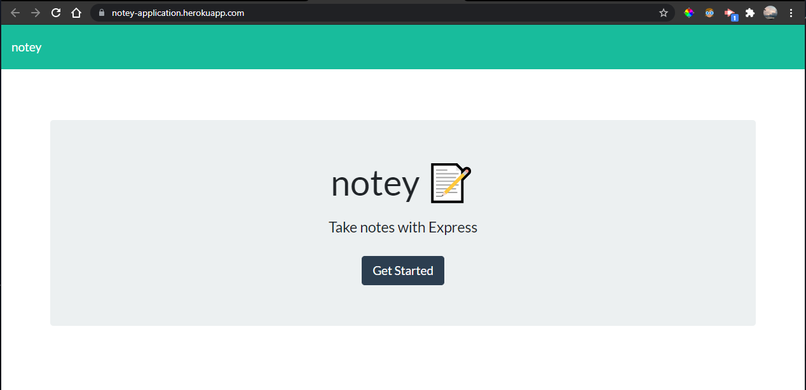
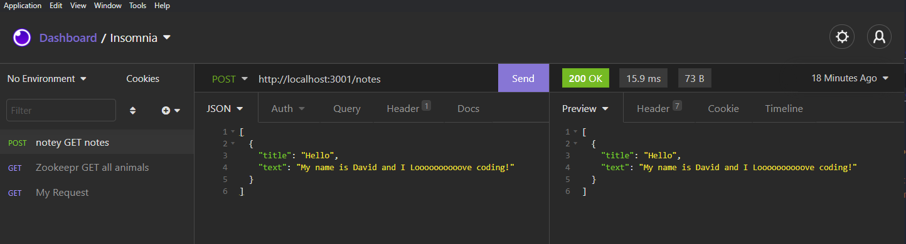

# Note Taker - notey

## About This Project

#### The notey is a front end application that interacts with a express.js based backend that uses the get and post methods to render data and add new note data.

## How it works:

#### The program initializes with a front end design that prompts you to 'get started'. Afterwards you will be redirected to a new page /notes. Here you can save create new notes and save them.

### Insomnia showing successful post

### Heroku Deployed Application

## Challenges:

#### I ran into issues getting the notes page to appear after clicking the 'get started button' I found that I was not referencing the index.js /api/notes correctly. Also I was unable to answer the bonus question of how to delete notes. I also ran into issues finding how to get the new notes to appear on the left side of the screen. I believe I messed something up in the way files are loaded as my notes page seemed to have styling issues. However I was able to successfully test a post with insomnia as displayed with the images above.
